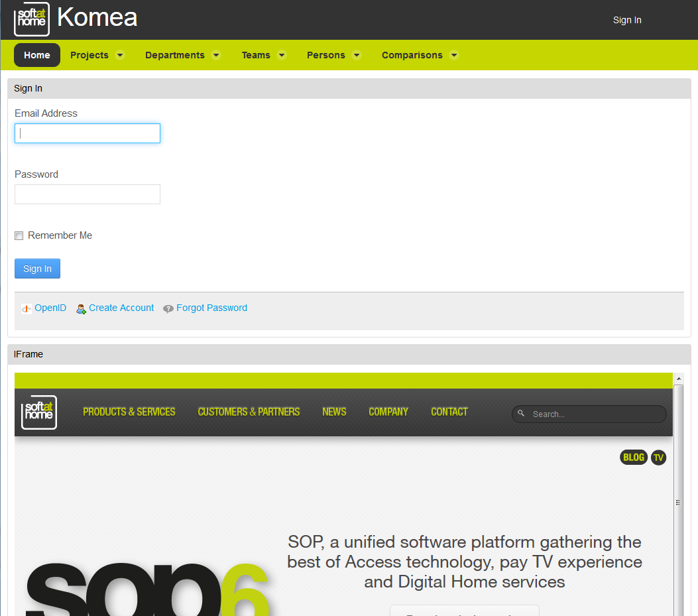
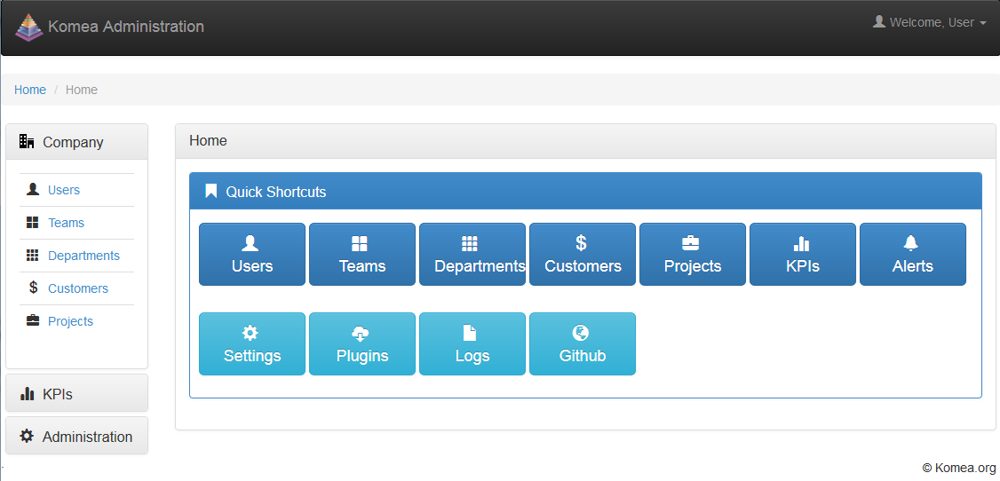
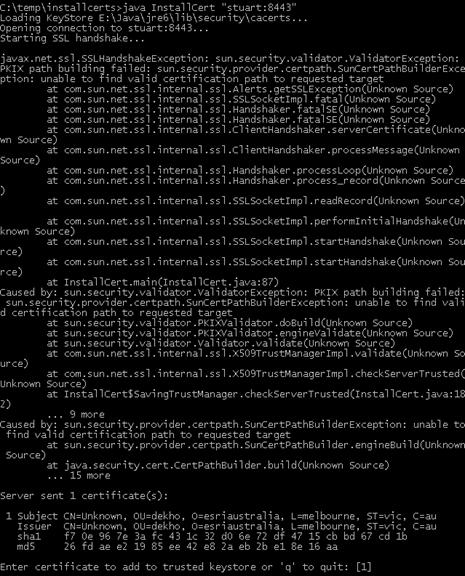

% Komea installation guide
% Tocea <a href="http://www.tocea.com" target="_blank">http://www.tocea.com</a>


Installation guide
======================


System Requirements {.western}
===================

Hardware {.western}
--------

- RAM : 4GB

- Hard-Drive Space : 20GB

- Processor : 1 Quad-Core 2.5Ghz

-   

Software {.western}
--------

-   Operating System : Linux OS

-   Java 6

-   Database : MySQL v5

-   Komea packaging (ZIP file) including :

    -   komea (Directory)

    -   komea-jenkins-provider.hpi

    -   sonar-komea-plugin.jar

Komea architecture {.western}
==================

Komea is composed of two main parts:

-   Komea administration (called ‘Komea’), to manage all data of Komea
    (used by administrators). Komea administration is a web application
    (war file).

-   Komea GUI (called ‘Liferay’), to view dashboards (used by everyone).
    Komea GUI is a list of portlets integrated in the portal named
    ‘Liferay’ ([www.liferay.com](http://www.liferay.com/))

Liferay portal is bundled with a web server named ‘Tomcat’ which
contains the application Komea administration.

Liferay (Komea dashboards) is accessible from url:
`http://[server]:[port]/`

Komea (Komea administration) is accessible from url:
`http://[server]:[port]/komea/`

-   


Komea GUI {.western}
=========

Liferay installation {.western}
--------------------

-   Unzip the file `komea-packaging.zip`

-   Copy the directory named ‘komea’ to a location of your choice

-   

Changing ports {.western}
--------------

-   By default Tomcat uses the port 8080.

-   You can change it in the following file :
    `[komea]/tomcat-7.0.42/conf/server.xml`

-   

-   For more details of Tomcat configuration please refer to their
    official documentation at the following link :
    [http://tomcat.apache.org/tomcat-7.0-doc/index.html](http://tomcat.apache.org/tomcat-7.0-doc/index.html)

-   

Start and Shutdown Liferay {.western}
--------------------------

To start Liferay execute the command ‘startup.sh‘ in directory
[komea]/bin

To shutdown Liferay execute the command ‘shutdown.sh’ in the same
directory.


Once Liferay is started open your browser and go to Liferay page.

You shoud see a page like below:



-   

Admin account {.western}
-------------

Default admin account is :

-   Login: `admin@liferay.com`

-   Password: `3vcBZt25`


-   You can create another admin user and delete the admin default
    account. (cf komea user guide)

-   

Data migration {.western}
--------------

Liferay comes with a default database called HSQL or ‘hypersonic’. This
is not meant for production use however! You need to switch to a real
database to use Liferay.

-   Log as admin and go to ‘Admin’ -\> ‘Control Panel’

-   Click on ‘Server Administration’

-   Click on ‘Data Migration’

-   Set your database configuration

-   Click on button ‘Execute’


Mail integration {.western}
----------------

Liferay sends email notifications like account created, password
changed, password reset...

-   Log as admin and go to ‘Admin’ -\> ‘Control Panel’

-   Click on ‘Server Administration’

-   Click on ‘Mail’

-   Set your mail configuration

-   Click on button ‘Save’

-   

LDAP configuration {.western}
------------------

-   Click on ‘Admin’ -\> ‘Control Panel’

-   Click on ‘Portal Settings’

-   Click on ‘Authentification’ -\> ‘LDAP’

-   Check ‘Enabled’ and click on button ‘Add’

-   Set your LDAP configuration

-   Click on ‘Save’ button

-   

For more details please refer to the official documentation:

[https://www.liferay.com/fr/documentation/liferay-portal/6.2/user-guide/-/ai/integrating-existing-users-into-liferay-liferay-portal-6-2-user-guide-17-en](https://www.liferay.com/fr/documentation/liferay-portal/6.2/user-guide/-/ai/integrating-existing-users-into-liferay-liferay-portal-6-2-user-guide-17-en)

-   

Komea Administration {.western}
====================

Database {.western}
--------

Komea comes with a default database called H2.

You can change this database configuration in file
[komea]/conf/komea.properties in the section ‘DATABASE’


Admin account {.western}
-------------

Komea administration is accessible from http://[server]:[port]/komea and
the default account is the following:

-   Login: `admin`

-   Password: `3vcBZt25`

You can create another admin user and delete the admin default account.
(cf komea user guide)

Once authenticated, you should see a page like below:




LDAP configuration {.western}
------------------

Users can be imported from LDAP:

-   Go to ‘Server administration’ -\> ‘Server settings’

-   Put ‘ldap’ in the search bar of ‘Property Description‘

-   Set your LDAP configuration

-   Click on button ‘Save’

-   

TLS Authentication with certificate requires to download the certificate
on the server and makes it available to the JVM: for more information
please refer to following website:

[http://docs.oracle.com/javase/jndi/tutorial/ldap/ext/starttls.html](http://docs.oracle.com/javase/jndi/tutorial/ldap/ext/starttls.html)

-   


Jenkins plugin {.western}
==============

Installation {.western}
------------

-   Go to Jenkins page and log as admin

-   Click on ‘Manage Jenkins’

-   Click on ‘Manage plugins’

-   Click on ‘Advanced’

-   Click on ‘Choose File’ and select file komea-jenkins-provider.hpi
    and click on button ‘Upload’

-   

Global Configuration {.western}
--------------------

-   Click on ‘Manage Jenkins’

-   Click on ‘Configure System’

-   Go to section ‘Jenkins Location’ and set Jenkins url if it is not

-   Go to section ‘Komea’ and set Komea url

-   You can test the connection to Komea with the ‘Test Connection’
    button

-   Click on button ‘Save’

-   

Job configuration {.western}
-----------------

-   Go to the configuration page of the desired job

-   Click on button ‘Add post-build action’ and select ‘Komea Notifier’

-   Set key of the project in Komea, name of the SCM branch and level of
    industrialization of the job

-   You can send testing events to Komea with the ‘Test Events’ button

-   Click on button ‘Save’

-   These steps are required for each job you want to push to Komea

Sonar plugin {.western}
============

Installation {.western}
------------

-   Stop Sonar

-   Copy ‘sonar-komea-plugin.jar’ to [sonar]/extensions/plugins

-   Start Sonar

-   

Configuration {.western}
-------------

-   Go to Sonar page and log as admin

-   Click on ‘Settings’

-   Click on ‘General’

-   Set ‘Server base URL’ if it is not

-   Save configuration

-   Click on ‘Komea : sonar provider’

-   Set Komea url

-   Save configuration

Bugzilla plugin {.western}
===============

Bugzilla server installation {.western}
----------------------------

First, install bugzilla version 4.0.2.

Follow the instruction of the official website:
[Installation guide bugzilla](http://www.bugzilla.org/docs/4.0/en/html/installation.html "Installation guide bugzilla") 

Remote API {.western}
----------

The remote access API of Bugzilla must be activated.

To check it, test the following url:
`http://\<BUGZILLA\_DOMAIN\>/xmlrpc.cgi`. The result page must be empty.

If the connection failed, you must follow these steps:

-   Check if these Perl modules are installed (`Test::Taint`, `XMLRPX::Lite`
    and `SOAP::Lite`). To do this, go to the Bugzilla directory and launch
    this command :

-   ```bash ./checksetup.pl --check-modules ```

-   To install the missing modules :

-   ```bash perl install-module.pl \<modulename\> ```

-   These libraries can also be necessary (```bash make, libsoap-lite,
    librpc-xml-perl, libtest-taint-perl```)
    
```bash
-   apt-get install make libsoap-lite librpc-xml-perl libtest-taint-perl
```    


TestLink plugin {.western}
===============

Add a Testlink server {.western}
---------------------

-   Coming soon

SSL & server certificate {.western}
========================

How to install SSL certificates? {.western}
--------------------------------

If services that Komea try to contact are over SSL (eg: a Bugzilla
server), then Komea server needs to be authenticated. To do this follow
these steps on Komea server:

-   Unzip **InstallCert.zip**

-   Run **InstallCert** with hostname and https port of the server (eg:
    “**java InstallCert****bugzillaServer****:8443**”), you should get
    an output like below.



-   Press “**1**” when ask for input. You should see output like below
    and it will generate a file named “**jssecacerts”**.


-   Copy the generated `**jssecacerts**` file to your
    `**\$JAVA\_HOME\\jre\\lib\\security**` folder

-   Restart Komea


For more details please refer to this link:

[https://blogs.oracle.com/gc/entry/unable\_to\_find\_valid\_certification](https://blogs.oracle.com/gc/entry/unable_to_find_valid_certification)
